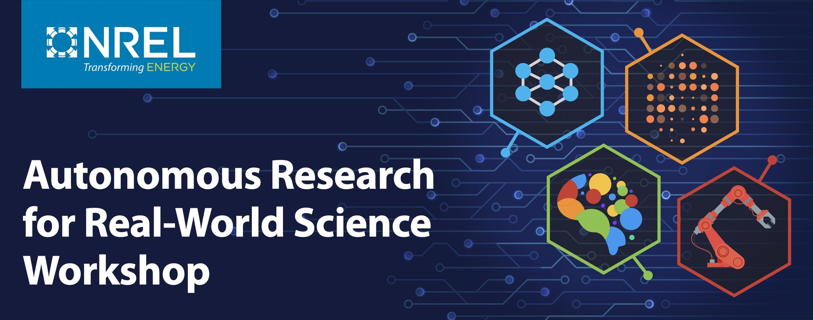

We're thrilled to announce the first Autonomous Research for Real-World Science (ARROWS) Workshop, taking place in Golden, CO, on May 19-21! Co-organized by Steven Spurgeon, Andriy Zakutayev, and myself, this workshop is a chance to dive deep into how autonomy is reshaping materials and chemical sciences.

Key themes include:
* Materials and Chemical Science Grand Challenges
* Domain-Specific Analytics and Visualization
* Autonomous Decision-Making
* Real-World Technical Implementations

We have a limited number of registration spaces available, so if you are interested [sign up today](https://www.nrel.gov/materials-science/autonomous-research-for-real-world-science-workshop).
